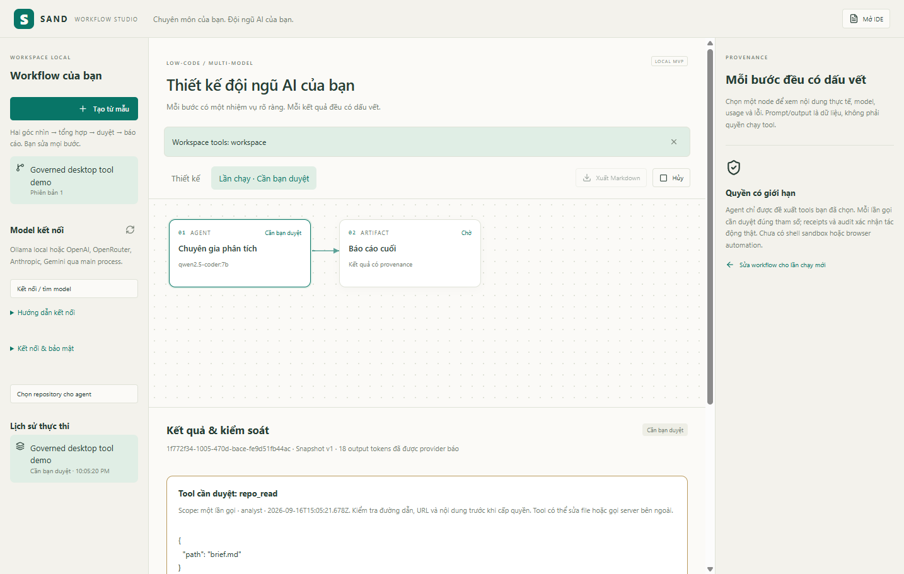

# SAND

**A low-code, multi-model AI workflow IDE for people who know their field.** Runnable Windows development preview; the expanded Stage 1 is **not complete**, and this is not production-ready.

Domain experts need specialist agents, explicit data flow and reviewable results—not just chat. SAND combines a visual workflow composer with Monaco and a local execution engine. Agents can propose repository or research/MCP tools; every call requires approval of its exact arguments. Runs, model turns, approvals and receipts survive restart.

**Complete demonstrated workflow:** choose a model → agent requests a tool → policy asks → persist approval → restart SAND → approve → execute the actual tool → review → report with verifiable audit. A separate template runs two local models in parallel, then synthesizes their results.

## Start / demo

Prerequisites: **Node 24.x, npm 11, Git**. Real inference needs Ollama running with an installed model. No Docker, PostgreSQL server or cloud key is needed for the local workflow.

~~~sh
npm ci
npm run setup:desktop
npm run dev
~~~

In Studio: find models, choose a repository, select tools on an agent, select **Ollama JSON** protocol for the observed Qwen installation, enter a task and run. Inspect the approval inbox before granting a tool. [Exact walkthrough, MCP, credentials and OIDC configuration](docs/governed-tools.md).

~~~sh
npm run demo:desktop  # runs actual Ollama + tool + restore, then opens the completed run
npm run demo:tools    # real repository read + durable approval + audit, terminal evidence
npm run demo:edit     # real recoverable edit in a NEW generated demo workspace
npm run demo:research # real public HTTPS retrieval; no synthetic search results
npm run demo:mcp      # real stdio MCP server + actual model tool request
npm run demo:studio   # two installed local models, three calls, review/report
npm run demo          # offline PGlite + real HTTP/replay; no AI inference
~~~

Tool demos fail if the model does not request the expected call. Their scripted consent is restricted to the exact non-sensitive demo operation; desktop consent is interactive. Outputs are saved under a new .runtime directory on every run.

## Architecture

~~~mermaid
flowchart LR
  UI[React Studio / Monaco] --> IPC[Typed preload + checked Electron main]
  IPC --> Runtime[Local DAG + shared policy]
  Runtime --> DB[(SQLite checkpoints / tool journal / audit)]
  Runtime --> Models[Ollama / configured cloud adapters]
  Runtime --> Gate[Argument-bound approval]
  Gate --> Tools[Repository broker / MCP client / HTTPS research]
  IPC --> Vault[OS encrypted credentials / system-browser OIDC]
  IPC -. separate foundation .-> API[Fastify / PostgreSQL RLS / outbox / WebSocket replay]
  API --> Temporal[Temporal registry workflow]
~~~

Stack: Electron, React, TypeScript, Monaco, SQLite; Fastify, PostgreSQL/PGlite, Temporal, OpenTelemetry; official MCP SDK and JOSE. Local Studio and the cloud foundation have separate guarantees; agent DAGs are not yet Temporal workflows. [ADRs](docs/architecture/adrs.md) · [Threat model](docs/security/studio-threat-model.md).

## Evidence / verification

Actual Windows/Ollama observations on 2026-09-16: governed read completed in **1,918 ms**, with **2 real model turns, 1 tool call, 6 events preserved on database reopen and 17 audit events verified**. Public HTTPS and MCP demos also executed actual calls. These are single samples, not p95 or quality benchmarks. A model misdescribed a successful file-edit receipt in one run; the UI exposes system evidence separately. [Measured report and raw evidence](docs/reports/governed-preview.md).

~~~sh
npm run lint
npm run typecheck
npm test
npm run build
npm run test:e2e
~~~

Verified: **164 regression tests passed**, **5 real Temporal tests passed**, and **8 Electron E2E tests passed across the live suite and separate full-stack run**. See the report for skips and boundaries.

Live Electron tests require SAND_STUDIO_LIVE_TESTS=1 and actual local models. Cloud contracts explicitly skip unless enabled with credentials AND a model ID; they never turn an unavailable provider into a fake pass. [Verification results](docs/reports/governed-preview.md).

## What works / what remains

Implemented: editable DAG, multi-model local inference, parallel steps, human review, pause/cancel/explicit resume, durable tool intent/receipt/approval, repository read/save, bounded public-web retrieval, Wikipedia search adapter, MCP stdio/Streamable HTTP, hash-chain audit, report export and local backup/restore. OS-protected credential storage is live-tested on Windows. OpenAI/OpenRouter/Anthropic/Gemini text adapters and a system-browser OIDC client exist; external credentialed operation remains unverified.

Still missing: remote MCP OAuth; backend OIDC/RBAC; refresh rotation; cloud agent workflows and isolated workers; terminal/LSP/full Git/GitHub App; browser automation; conditional/scheduled workflows; monetary budgets and provider failover; hosted TLS/IAM/operations; signed installers/updates and cross-platform validation. OIDC desktop login does not authorize backend tenants. Stdio MCP has OS-user authority. Documents/transcripts are plaintext; audit has no external anchor. Model output and secret scanning are fallible. No production readiness, competitor parity or alpha-generation quality claim.

[Expanded two-stage roadmap](docs/product/roadmap-two-steps.md) · [Stage 1 gates](docs/product/stage-one-gates.md) · [Alternative-inspired matrix](docs/product/alternative-parity.md). Stage 2 is feedback, polish and debugging after Stage 1 gates pass; required features have not been moved there to imply completion.

## Resume bullet

- Built an Electron/React multi-model workflow IDE with persistent DAG state, argument-bound tool approvals, MCP integration and verifiable audit receipts. 
  Validated actual Ollama execution, repository effects, encrypted credential storage and recovery across a full desktop restart with automated tests.
