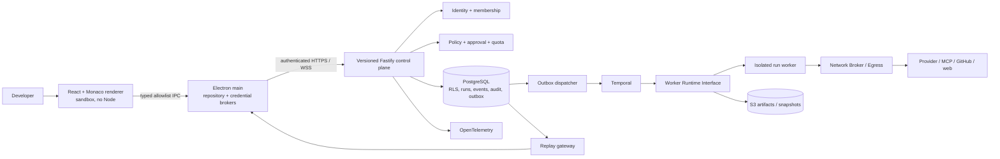

# Kiến trúc SAND

## Ranh giới

API là modular monolith, không gộp quyền thực thi repository code vào API process. Các module identity, projects, runs, policy, quota, events, audit, registry, GitHub và artifacts có contract riêng. Worker/dispatcher là process deploy độc lập, dùng chung domain package; Redis chỉ là tối ưu phụ trợ khi có nhu cầu đo được.

## Source of truth và bảo đảm

PostgreSQL transaction ghi run + event + audit + outbox trước HTTP 202. Dispatcher khởi tạo Temporal bằng workflow ID ổn định, retry sau crash; DB và Temporal không có distributed transaction. Temporal workflow deterministic; I/O nằm trong activities. Side effect cần operation receipt hoặc reconciliation; không suy ra exactly-once từ workflow durability.

Event có UUID ổn định và sequence theo run, version schema. REST replay là nguồn kiểm tra; WebSocket delivery at-least-once với ACK, bounded batch, backpressure và snapshot khi cursor cũ. Audit chain phát hiện sửa lịch sử nếu đầu chuỗi đã được checkpoint ở trust boundary khác; hash chain đơn lẻ không chống database administrator viết lại toàn bộ ledger.

## Domain model đích

Organization → Workspace → Project; User ↔ Membership(Role); Session/Device. Run → Task → Step → Attempt → ToolCall/Approval/EffectReceipt. Run liên kết WorkerLease, QuotaReservation, CostEntry, ModelSelection, Event, Artifact, Checkpoint, Branch, Commit, PullRequest. Mọi entity tenant-bound có tenant key và composite FK. ModelSnapshot/PricingSnapshot có source, fetchedAt, override actor/reason/version.

Run state machine đích: queued → running ↔ paused/awaiting_approval → completed|failed|cancelled; cancellation_requested là intent durable, không tự báo worker đã dừng. Ambiguous external effect → reconciliation_required. Exhausted recovery → dead_letter. Batch 01 chỉ triển khai tập con được ghi trong batch report.

## Môi trường

| Thành phần | Local | Cloud / production |
|---|---|---|
| Desktop/editor/Git | Windows, OS filesystem | macOS validation + code signing |
| Control plane | loopback development identity; PostgreSQL thật | OIDC, TLS ingress, runtime DB role không BYPASSRLS |
| Workflows | Temporal dev server + worker process | Temporal Cloud hoặc cluster HA với auth/mTLS |
| Registry | API thật, credential từ process environment | Vault/KMS, egress policy, scheduled refresh |
| Agent code execution | chưa mở; Docker dev sau | Kata/Firecracker, network namespace, short-lived scopes |
| Artifacts/backups | dev volume, explicit export | S3 SSE-KMS, retention/WORM, restore drills |

Không được public hóa local development identity. Production startup phải fail closed nếu identity/secret/worker requirements chưa được triển khai.
