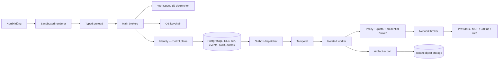

# SAND — Threat model

Phiên bản thiết kế: 0.1 · Ngày: 2026-09-07 · Owner đề xuất: Security + Architecture.

**Đây là mô hình đe dọa trước triển khai.** Nguồn kiến trúc là yêu cầu sản phẩm của người dùng và phạm vi batch được nhóm thiết kế lựa chọn. Khi soạn tài liệu, chưa có code để chứng minh các kiểm soát. Tất cả kiểm soát trong tài liệu đều là **planned** trừ khi một báo cáo kiểm chứng sau đó dẫn chính xác commit, file và test evidence. Các attack stories là giả thuyết thiết kế, không phải vulnerability đã xác nhận. Review độc lập dựa trên source cần thực hiện sau khi có implementation; tài liệu hiện tại được kiểm tra tuần tự, chưa có review độc lập.

Ghi chú sau triển khai batch 01: đã có [review implementation độc lập](implementation-review.md) và [báo cáo kiểm chứng](../reports/batch-01.md). Phần dưới giữ nguyên góc nhìn thiết kế ban đầu; trạng thái implementation phải đọc cùng hai báo cáo này.

## 1. Overview — Kiến trúc và cách sử dụng

SAND là desktop workbench cho lập trình bằng AI. User mở repository bằng dialog thuộc main process. Renderer hiển thị dữ liệu qua preload nhỏ và typed; không được sở hữu filesystem/process/secret authority. Control plane dạng modular monolith quản lý identity, project, policy, approval, run, quota và audit. PostgreSQL là nguồn sự thật; Temporal chạy workflow; worker tách biệt thực thi công việc. Model, website, repository và MCP chỉ cung cấp dữ liệu hoặc đề xuất hành động. Quyền thực thi đến từ policy và identity được kiểm chứng.

| Thành phần | Boundary và dữ liệu | Nguồn/bằng chứng hiện tại |
| --- | --- | --- |
| Electron renderer/preload/main | UI → typed IPC → host brokers | Yêu cầu người dùng; chưa có source evidence |
| Repository/Git broker | Handle của workspace → path/operation → filesystem/Git | Batch đầu dự kiến mở/list/read/write, Git status/diff thật |
| Identity + API/WebSocket | Session → tenant/project → run, event, audit | Thiết kế; auth production và tenancy cần test riêng |
| PostgreSQL + transactional outbox | Run acceptance, idempotency, event sequence, audit intent | Thiết kế; Redis không được làm nguồn sự thật |
| Temporal + dispatcher | Outbox → stable workflow ID → activity/attempt | Thiết kế; chưa chứng minh crash recovery |
| Worker Runtime Interface | Run/trust boundary → CPU/RAM/disk/network lease | Local/Docker cho development; Kata/Firecracker tương đương cho production |
| Policy/approval/quota broker | Proposed action → decision/reservation → execution permit | Thiết kế; enforcement bắt buộc tại sensitive consumer |
| Provider/MCP/GitHub brokers | Scoped secret reference + validated request → external service | Thiết kế; không có cấu hình phải `unavailable` |
| Network broker/browser isolation | Tool scope → DNS/IP/redirect validation → egress | Thiết kế; browser không có Node/keychain |
| Artifact/audit/observability | Bounded redacted output → tenant storage/ledger | Thiết kế; cần encryption, retention và integrity evidence |
| Build/update/signing | Pinned source/dependency → signed installer/update | Chưa có release infrastructure hoặc signing evidence |

Mũi tên là flow dự kiến, không thể hiện quyền mạng ngầm định. Hạ tầng phải chặn worker/renderer đi vòng qua broker; chỉ có một HTTP helper không tạo được egress isolation.

### Tài nguyên hiệu lực cần kiểm tra theo startup/deployment

| Deployment hoặc workflow | Resource/capability | Cấu hình và thứ tự ưu tiên dự kiến | Giá trị/vị trí hiệu lực an toàn | Người nhận/quyền | Điểm cưỡng chế | Bằng chứng hoặc điểm chưa rõ |
| --- | --- | --- | --- | --- | --- | --- |
| Desktop local | Workspace filesystem | Native user selection → canonical root → opaque handle | Root đã được chọn; không nhận absolute root tùy ý từ IPC | Main broker; renderer chỉ dữ liệu được phép | Sender/main-frame check, schema, path containment, size/secret filter | Cần Windows reparse/UNC/ADS và macOS symlink tests |
| Desktop local | Git executable/config | Executable do ứng dụng/operator tin cậy → argv cố định → repo đã chọn | Không qua shell; vô hiệu external diff/textconv/fsmonitor; không ghi `.git` bằng file API | Broker thực thi Git read-only trong batch đầu | Bounded output/time, sanitized environment, explicit Git configuration | Git hooks/config là code-capable input cần source review |
| Desktop local | API/provider secrets | OS keychain → main-owned reference | Không trả secret qua IPC; không plaintext fallback | Main broker đúng chức năng | Keychain access + audit metadata | Provider credential UI chưa được triển khai |
| Development backend | Database/Temporal | Explicit development configuration | Loopback/private dev endpoints; credential reference ngoài repository | Server và dispatcher; renderer không kết nối DB | Bind address, startup guard, separate runtime/migration roles | Dev identity không phải production authentication |
| Production backend | Tenant records | Verified session → membership lookup → transaction-local tenant context | PostgreSQL tenant scoped rows | Non-owner runtime role | RLS/FORCE RLS + scoped query + composite tenant foreign keys | Cần tests với pool reuse, exports, workers, WebSocket |
| Temporal activity | Side-effect identity | Durable tool-call/attempt → logical operation key | Key ổn định qua retry/failover; không chứa secret | Tool executor đúng run/tenant | Unique constraints + execution lease/fence + reconciliation | Exactly-once effect không được mặc định suy ra từ workflow |
| Development worker | Process/container | Explicit development runtime selection | Ephemeral directory; Docker socket không mount vào worker | Job process theo user/container hạn chế | Runtime adapter và quotas thực tế được test | Local process không cô lập khỏi cùng OS user; chưa dành cho untrusted agent |
| Production worker | Runtime/egress | RuntimeClass + organization/project policy → admission | MicroVM/Kata boundary, ephemeral volume, egress proxy | Một run hoặc trust boundary | Scheduler, seccomp/AppArmor, network namespace, cgroup, broker | Cần cluster và escape/limit/reclaim evidence; không được fallback local im lặng |
| MCP OAuth | Access/refresh tokens | Validated server/resource metadata → PKCE consent → vault reference | Token audience/resource-bound; refresh rotation nếu hỗ trợ | Chỉ MCP server đã cấp quyền | OAuth broker + exact redirect/state/nonce + scope diff | Chưa có remote OAuth compatibility evidence |
| Artifacts/audit | S3 objects, encryption/signing keys | Tenant metadata → object namespace → scoped server capability | Tenant prefix + validated object ID; encryption keys trong KMS/Vault | Authorized reader/exporter | Server authz, storage IAM, signed URL scope/expiry | Prefix đơn thuần không bảo đảm tenancy; WORM/anchor chưa có |
| Release/update | Signing identity và artifacts | Reviewed source/lockfile → isolated CI → signing service | Secret reference trong signing job; signed channel metadata | Release role tách khỏi application runtime | Signature/version/platform validation; approval của release owner | Windows signing + macOS signing/notarization chưa được cấu hình |

Batch đầu chỉ cho local repository operations và durable run/event/audit foundation đã có backend tương ứng. Workflow đầu là `registry.refresh`: gọi model discovery API thật, giữ provenance/timestamp và trả trạng thái unconfigured/unreachable đúng thực tế. Discovery không chứng minh inference/streaming/tool calling đã có. Credential development, nếu lấy từ environment của server, không được truyền renderer/worker/model hoặc đưa vào log; đây chưa phải Vault production. Xem [kiến trúc dự kiến](../architecture/overview.md) và [contract v1](../architecture/contracts.md).

Không tự chạy package scripts, Git hooks, LSP, terminal, browser automation hay agent trong repository vừa mở. Agent execution, OAuth production và cloud worker chỉ được bật ở slice đã có enforcement cùng test.

## 2. Threat Model, Trust Boundaries, and Assumptions

### Tài sản và mục tiêu

- Bảo mật code, user/organization data, credentials và quyền tài khoản; secrets không vào renderer/model/log/audit plaintext.
- Bảo toàn file người dùng, Git history, run đã nhận, identity/tenant context, approval scope, event order và ledger integrity.
- Mọi hành động đặc quyền có actor/target/policy/provenance và chi phí có nguồn/timestamp; không có success giả.
- Không vượt CPU/RAM/disk/network/runtime/cost budget bằng concurrency, retry hoặc failover.
- Khôi phục crash/cancel/reconnect không mất event hoặc tạo side effect trùng; delivery là at-least-once với deduplication.

### Actor và năng lực ban đầu

| Actor | Có thể kiểm soát | Không được mặc định đã có |
| --- | --- | --- |
| Repository contributor độc hại | File, symlink, `.git` configuration khi người dùng mở clone/worktree, issue/README/script | Main process, host keychain, policy hoặc user approval |
| Website/MCP server/model không đáng tin | Response, tool descriptions/schema, redirects, prompt-injection text | Credential của server khác, filesystem host, network scope mới |
| Tenant member | Object IDs/arguments gửi qua API, runs và nội dung trong tenant được cấp | Tenant khác, org admin, unlimited quota |
| Attacker ngoài mạng | API requests, giả webhook, guessed IDs, malformed stream frames nếu endpoint exposed | Session hợp lệ, signing key, internal DB access |
| Worker bị chiếm quyền | Workspace ephemeral và capability đã cấp cho run | Host socket, cloud admin credential, other run volume, direct egress |
| Renderer bị chiếm quyền | UI state, mọi IPC callable của renderer, nội dung renderer nhận | Node/process/secret store; không được giả native sender authority |
| Dependency/build adversary | Package hoặc artifact/update source không tin cậy | Reviewed lockfile, signing service, release approval |
| Operator sai sót/credential bị lộ | Quyền thực của account đó | Tự suy rộng thành mọi actor đều là DB superuser hoặc OS admin |

### Các boundary độc lập

1. **Renderer → main:** sender/frame/origin được kiểm chứng, IPC schema và allowlist; không generic `exec`, `readFile(absolutePath)` hoặc secret export. CSP và sandbox giảm bề mặt, không thay thế operation authorization.
2. **Repository → host:** content là dữ liệu. Path normalization phải đi cùng containment tại filesystem; link/junction/TOCTOU không được coi là đã xử lý chỉ bằng `startsWith`. Git, LSP và test runner là process boundaries riêng.
3. **Desktop/API → tenant data:** authenticated principal được map thành membership phía server; transaction/worker/export/replay cùng tenancy. `tenantId` trong payload/cursor không cấp quyền.
4. **Agent suggestion → side effect:** canonical payload, target revision và policy version được buộc vào approval/execution permit. Executor rechecks policy/revocation/quota và execution fence; tool manifest visibility không phải authorization.
5. **Coordinator → worker:** scoped work/capability lease, quota và cancellation; worker không tự chọn tenant, lấy credential hoặc mở toàn host.
6. **Broker → network/provider/MCP/GitHub:** data classification, destination, audience/scope, retention/region và budget ràng buộc cả retry/failover. Tool result không thể đổi system policy.
7. **Mutable store → provenance/audit/export:** append-only quyền ứng dụng; serialization và sequence rõ ràng; hash chaining + external anchor/signature để phát hiện rewrite/truncation vượt phạm vi DB.
8. **Build/update → desktop:** code signing/update verification và provenance; update metadata không được dùng để downgrade hoặc tải privileged remote code.

### Giả định, loại trừ và câu hỏi còn mở

- Đây là multi-tenant target design; việc batch đầu chỉ có một tenant không miễn kiểm tra tenant isolation. Production topology, region, KMS, IdP, GitHub App và signing identity chưa được người dùng cấp/cấu hình.
- OS/kernel, trust store, managed administrator và signing service được tin trong mô hình cơ sở. Nếu host đã bị local administrator kiểm soát, keychain/encryption của ứng dụng không tạo ranh giới bảo vệ tuyệt đối; vẫn cần revocation và incident response.
- Local development identity/static token, nếu có, phải bị khóa ở development + loopback. Chưa thể tuyên bố OIDC/RBAC hay remote deployment an toàn dựa trên dev mode.
- Secret scanning là lớp giảm rủi ro cho source có secret vô tình; không chứng minh phát hiện mọi chuỗi bí mật tùy ý. Credential store phải được cách ly cấu trúc, dữ liệu classified secret bị chặn trước renderer/model. Chính sách repository secret handling phải được kiểm tra ở code slice tương ứng.
- JavaScript path precheck không loại bỏ hoàn toàn concurrent link-swap. Nếu chưa có atomic/native handle validation, phải ghi rõ giới hạn và không cho untrusted concurrent worker dùng host filesystem broker.
- Terminal có thể chạy mã tùy ý khi được cấp quyền; command-string allowlist không phải sandbox. Production terminal/agent có boundary, network và quotas riêng.
- Crash-report collection mặc định phải tắt khi chưa có redaction được kiểm chứng. Dump toàn bộ memory có thể chứa secrets và không được coi là log đã redaction.
- Retention, ZDR, region và giá của provider là metadata có provenance/timestamp; giá không xác định không được hiển thị là 0 hoặc dùng để bỏ admission budget.
- Cần xác định số lượng users/runs, retention thật, backup region, security owner và incident SLA trước production readiness review.

## 3. Attack Surface, Mitigations, and Attacker Stories

`Existing controls` đều là **chưa kiểm chứng** ở thời điểm thiết kế; không có finding đã xác nhận. `Evidence` tham chiếu acceptance ID cần chạy sau triển khai, không phải test đã pass. Priority là thứ tự thiết kế, không phải severity của một lỗ hổng hiện hữu.

| Priority | Scenario và quyền mới đạt được | Prerequisite | Impact | Existing controls | Mitigation dự kiến | Evidence cần có |
| --- | --- | --- | --- | --- | --- | --- |
| P0 | Repository độc hại kích hoạt script/hook/fsmonitor khi chỉ mở hoặc xem diff | Người dùng mở repository attacker-controlled | Host code execution dưới user của app | Chưa kiểm chứng | Mở repo không auto-execute; Git argv cố định, tắt external helpers; execution cần policy | SEC-REPO-01/02 |
| P0 | Prompt injection trong source/issue/web/MCP biến dữ liệu thành quyền gửi file hoặc chạy command | Agent đọc untrusted context | Exfiltration, commit/deploy trái phép | Chưa kiểm chứng | Tách instructions/data, broker enforcement độc lập model, scoped capabilities, argument-bound approval | SEC-AGENT-01, SEC-POLICY-01 |
| P0 | Tool/export/log vô tình đưa keychain/provider secret vào prompt, renderer hoặc audit | Broker xử lý credentials/output | Account compromise và lộ dữ liệu | Chưa kiểm chứng | Secret references, no IPC secret getter, redaction trước sink, secret canary tests | SEC-SECRET-01/02 |
| P0 | Renderer compromise gọi IPC giả/frame con để đọc file ngoài repo hoặc chạy process | Nội dung gây UI execution hoặc compromised dependency | Host file/process authority | Chưa kiểm chứng | Isolation/sandbox/CSP, trusted sender/frame, typed allowlist, root handles, no remote privileged content | SEC-IPC-01/02 |
| P0 | Path traversal/UNC/ADS/device paths bỏ containment | Có quyền đề xuất file operation | Read/write ngoài granted root | Chưa kiểm chứng | Canonical root, platform path rejects, allowed operation, file size bounds | SEC-PATH-01 |
| P0 | Symlink/junction hoặc concurrent link-swap chuyển write ra ngoài root | Repository chứa link hoặc có writer concurrent | Host file overwrite/exfiltration | Chưa kiểm chứng | Reject unsupported links/reparse points, handle-based validation, safe atomic writes; không claim TOCTOU-safe nếu chỉ precheck | SEC-PATH-02 |
| P0 | Command injection qua filename/branch/arguments hoặc môi trường Git | Broker tạo command bằng string hoặc thừa kế config không an toàn | Host code execution | Chưa kiểm chứng | `shell:false`, argv array, option terminator, validation, environment/config allowlist | SEC-REPO-02 |
| P0 | SSRF qua DNS rebinding, redirect, encoded IP hoặc IPv6 mapping | Tool/browser được phép outbound | Cloud metadata/private services access | Chưa kiểm chứng | Domain + resolved IP checks mỗi hop, kết nối IP đã kiểm tra với TLS hostname đúng, cấm metadata/private ranges, bounded redirects | SEC-NET-01/02 |
| P0 | Worker escape qua privileged container, host mounts, socket hoặc cloud credential rộng | Attacker code chạy trong worker | Host/cluster hoặc run khác | Chưa kiểm chứng | MicroVM/Kata, nonprivileged/no socket, no host mount, ephemeral volume, scoped short-lived creds, seccomp/cgroups | SEC-WORKER-01/02 |
| P0 | Cross-tenant access qua IDs, replay cursor, artifacts, job hoặc pool context rò | Thành viên tenant A có session hợp lệ | Đọc/ghi dữ liệu tenant B | Chưa kiểm chứng | Verified membership, RLS runtime non-owner, SET LOCAL in transaction, composite keys, authz mọi entrypoint | SEC-TENANT-01/02 |
| P0 | Approval/replay request bị dùng lại với target/args/policy khác | Attacker có request/approval cũ | Unauthorized side effect | Chưa kiểm chứng | Canonical digest, scope/expiry/revocation, single-use consume transaction, idempotency body conflict, recheck at execution | SEC-POLICY-01/02, SEC-IDEM-01 |
| P0 | Retry/failover sau timeout lặp commit/PR/payment-like tool | External side effect thành công nhưng ACK mất | Duplicate state/chi phí/hành động | Chưa kiểm chứng | Logical operation key, fence, external reconciliation; unknown outcome không retry mù | SEC-IDEM-02, SEC-FAILOVER-01 |
| P0 | GitHub webhook giả hoặc replay tạo privileged action | Public webhook endpoint exposed | Run/PR/check trái phép | Chưa kiểm chứng | HMAC trên raw body, constant-time compare, delivery-ID uniqueness, repo-installation binding, expiry policy | SEC-GITHUB-01 |
| P0 | Supply-chain/update compromise thay installer hoặc downgraded binary | Attacker điều khiển download/update/package source | Persistent desktop code execution | Chưa kiểm chứng | Pinned lockfile, SBOM, isolated build, signed installer/update metadata, verify signature/version/platform | SEC-SUPPLY-01, SEC-RELEASE-01 |
| P1 | Dependency confusion dùng package cùng tên sai registry | Build resolve package ngoài nguồn cho phép | CI/build credential/code compromise | Chưa kiểm chứng | Explicit registry/scopes, lockfile integrity, immutable install, reviewed install scripts, build network policy | SEC-SUPPLY-01 |
| P1 | MCP độc hại đổi schema hoặc output để lấy token của server khác | User đã kết nối MCP server | Token theft hoặc privilege escalation | Chưa kiểm chứng | Manifest diff/hash, new tool default deny, audience/resource-bound tokens, no passthrough, result size/time bounds | SEC-MCP-01/02 |
| P1 | OAuth interception/mix-up qua callback giả/state cũ/scope mới | System browser auth đang diễn ra | Account/session takeover | Chưa kiểm chứng | Authorization Code + PKCE S256, single-use state, nonce validation khi OIDC, exact redirect/issuer/resource, bounded loopback listener | SEC-OAUTH-01 |
| P1 | Audit tampering sửa event/hash hoặc xóa đuôi để che hành động | DB write hoặc compromised app path | Mất tính tin cậy provenance/incident evidence | Chưa kiểm chứng | Append-only privileges, serialized chain, external signed anchor/WORM, verify/export, separate debug logs | SEC-AUDIT-01/02 |
| P1 | Failover sang provider khác retention/region làm lộ source | Provider unhealthy + automatic fallback được bật | Data policy violation | Chưa kiểm chứng | Filter lại classification/region/ZDR/approval trước mọi attempt; thiếu metadata thì loại candidate | SEC-FAILOVER-01 |
| P1 | Concurrent runs/retries/socket backlog vượt quota gây cạn tài nguyên | Authenticated user hoặc slow consumer | Availability loss, runaway cost | Chưa kiểm chứng | Atomic admission/reservation đa cấp, bounded output/events, backpressure, timeout, cancellation hierarchy | SEC-QUOTA-01, SEC-STREAM-01 |
| P1 | Browser content tải file/code rồi mở bằng host hoặc gọi Node | Preview/automation cho trang attacker | Renderer/host compromise | Chưa kiểm chứng | Separate session/process, no Node/preload secrets, download quarantine/size/MIME, scanner hook, no auto-execute | SEC-BROWSER-01 |
| P1 | Leak trong snapshot/artifact/export/backup ngoài tenant hoặc retention | Authorized export/restore job có scope sai | Bulk data exposure hoặc resurrect deleted data | Chưa kiểm chứng | Scope at retrieval, encrypted storage, expiry/redaction, restore authz + deletion/retention reconciliation | SEC-STORAGE-01, SEC-RESTORE-01 |

## 4. Severity Calibration — Mức độ và bằng chứng

| Mức | Ví dụ nếu có bằng chứng | Điều kiện làm giảm hoặc loại claim |
| --- | --- | --- |
| Critical | Remote unauthenticated input đạt arbitrary host/control-plane code execution; sai tenancy cho phép đọc hàng loạt secret mọi org; unsigned update được tự cài | Phải chứng minh entrypoint reachable và authority gain. Attacker cần sẵn signing key/OS admin thì không tự động là Critical của ứng dụng |
| High | Tenant A đọc artifact private của B; opened repo chạy host command không có consent; SSRF lấy cloud metadata credential; one-time approval dùng lại tạo privileged side effect | Downgrade nếu dữ liệu chỉ thuộc attacker, target không accessible hoặc executor thực sự deny trước sensitive operation |
| Medium | Member gây bounded cross-run resource exhaustion; audit gap ảnh hưởng investigation của một project; permission quá rộng nhưng cần consent rõ và impact giới hạn | Phải chỉ ra tài sản/privilege mới; warning UI đơn thuần không chứng minh exploit |
| Low | Metadata ít nhạy cảm hoặc hardening thiếu nhưng chưa có đường authority gain khả thi | Không gọi vulnerability khi chỉ thấy keyword hoặc khác sở thích kiến trúc |

Confidence và severity tách biệt. Thiếu source/test/deployment evidence là **open question**, không phải bằng chứng control hỏng hoặc hoạt động. Local development mode đã gắn nhãn không được dùng để suy ra production guarantee; nếu có thể bật mode đó vô tình trên endpoint exposed, startup guard trở thành security boundary cần review.
